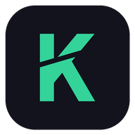
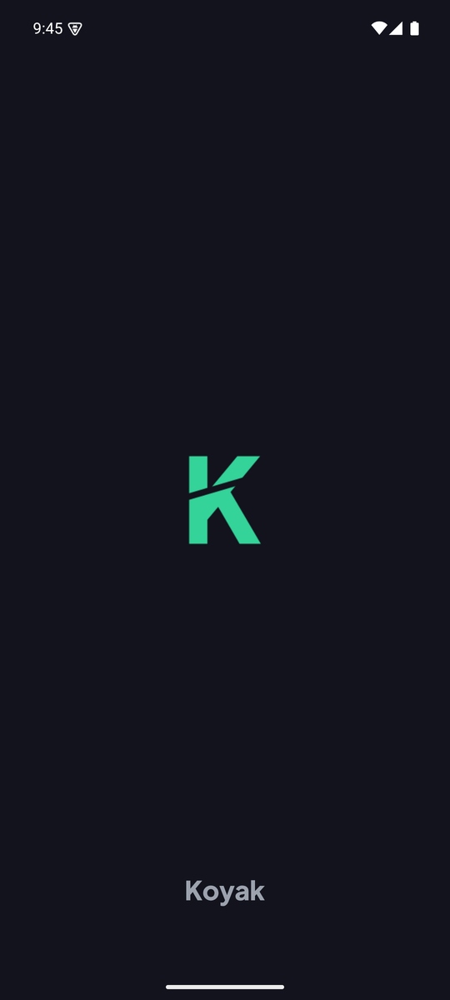
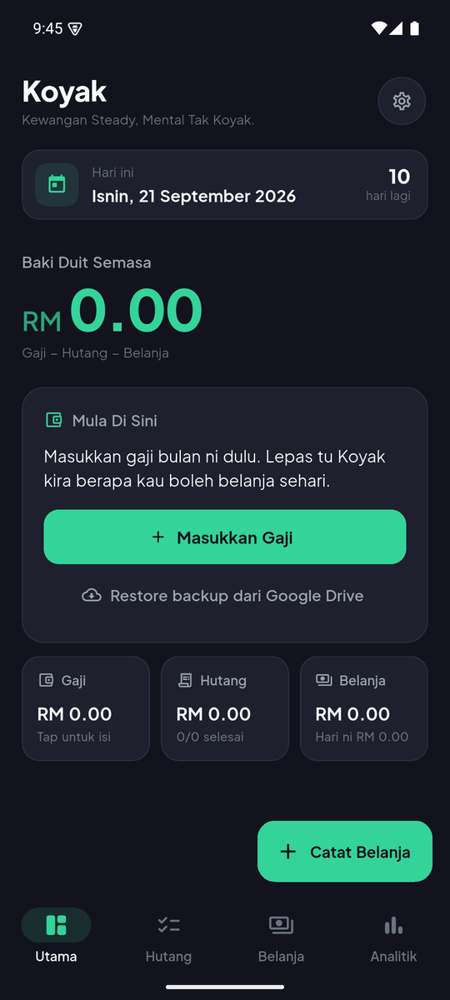
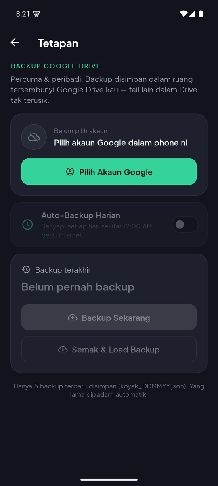

<p align="center">
  
</p>

<h1 align="center">Koyak</h1>

<p align="center">
  <b>Kewangan Steady, Mental Tak Koyak.</b><br/>
  A minimalist cashflow &amp; debt tracker built for Malaysia. Offline-first, and every amount is in RM.
</p>

<p align="center">
  
  &nbsp;
  
  &nbsp;
  
</p>

---

## What it does

Koyak answers one question every day: **how much can I spend today without going broke (koyak)?**

- **Baki Duit Semasa**: your live balance, shown big on the dashboard.
- **Daily limit**: *"Hari ni kau cuma boleh belanja RM XX.XX supaya tak KOYAK"*.
- **Money sources (Duit)**: every place your money sits, not just the salary: Gaji, bank balances, e-wallets, cash. Quick chips cover Gaji, Maybank, GX Bank, TNG and Tunai. Tap a source to top it up, set a new amount (RM 0 allowed), rename it or delete it. Adding a name that already exists this month tops that source up instead of listing it twice.
- **Debt tracker (Hutang)**: a checklist tagged **Halal / Bank** or **Risiko / Peribadi**, in two kinds:
  - **Bulanan**: a monthly commitment (PTPTN, kereta, kad kredit). The due day repeats every month, and an optional last month shows the countdown: *Hingga Dis 2027 · 16 bayaran lagi*, then *Bayaran terakhir*, then *Hutang selesai!*
  - **Sekali je**: a one-off (hutang kawan). Once ticked it's gone next month. If it isn't paid, it follows you into the next months under **Tertunggak** until you tick it.
- **Debt history (Sejarah Hutang)**: every finished month's debts, showing what was paid, what wasn't and what was tertunggak. **Hutang Selesai** lists debts that are paid off, past their last month, or removed, with how much went into each.
- **Quick expense log (Belanja)**: type an amount, tap a category, done in under 3 seconds. Categories are Makan, Minyak, Bil, Barang Dapur, Beli-belah and Lain-lain.
- **Analytics (Duit Habis Ke Mana?)**: how the month's money splits into debt, spending and what's left, plus a bar chart of spending per category.
- **Monthly history (Sejarah Bulanan)**: every finished month is kept. Tap one to see its full breakdown.
- **Nothing saved by accident**: every save shows a summary to confirm, and every delete asks first.
- **Optional Google Drive backup**: a daily auto-backup and a restore on a new phone, stored in the hidden app-data folder of the user's own Drive (free, no server).

## How the money works

| | |
|---|---|
| **Baki Duit Semasa** | Baki bulan lepas + Duit − Hutang − Belanja |
| **Had belanja harian** | Baki ÷ days left in the month (today included) |

- **Everything runs by calendar month, and nothing is deleted.** On the 1st, the dashboard starts a new month by itself, and the old month moves to history.
- **Duit** is the total of this month's money sources. Each source counts in the month it was recorded.
- **Carry forward.** Whatever is left at the end of a month rolls into the next one. A salary paid on the 25th therefore keeps working next month. An overspent month carries its negative balance too.
- **Hutang counts every debt for the month, paid or not**, because that money is already spoken for. A monthly debt starts every month unpaid, and payments are recorded per month. It stops counting after its last month.
- **A one-off debt counts once**, in the month it was added. If it's still unpaid, later months list it under Tertunggak without taking it off the baki again, because the carried-forward baki already paid for it.
- Removing a debt ends it from the current month onwards, so past months still show it. A debt added this month is deleted outright.

## Tech stack

- **Flutter 3.44 / Dart 3.12**, Material 3, dark-only UI with the bundled Plus Jakarta Sans font
- **MVVM** with `provider`
- **Local storage**: `shared_preferences` (JSON), fully offline
- **Charts**: `fl_chart`
- **Backup**: `google_sign_in` 7, `googleapis` (Drive v3, `drive.appdata` scope) and `workmanager` for the daily background task
- **Native Android splash & adaptive icon**, generated from the brand font

## Architecture

```
lib/
├── main.dart                 # bootstrap: locale, storage, background scheduler
├── app.dart                  # providers + MaterialApp
├── app_dependencies.dart     # composition root
├── background/               # WorkManager entry point (daily backup)
├── core/                     # theme, colours, RM/date formatters, config, errors
├── models/                   # Income, Debt, Expense, CashflowSummary, YearMonth, backups…
├── services/                 # PreferenceService, Google account, Drive backup, scheduler
├── repositories/             # Repository<T> + LocalRepository<T>, BackupRepository
├── viewmodels/               # Income / Debt / Expense / Cashflow / History / Backup + CashflowLedger
└── views/                    # dashboard, income, debt, expense, analytics, history, settings, shared widgets
```

- The view models depend only on the `Repository<T>` interface, so the tests swap in in-memory fakes.
- `CashflowLedger` holds the month-by-month maths, including carry forward. Both the dashboard and the history screens use it.
- Clocks are injectable, which lets the tests move time across month boundaries.

## Getting started

```bash
flutter pub get
flutter run                 # debug on a connected device / emulator
flutter test                # unit + widget tests
flutter build apk --release # build/app/outputs/flutter-apk/app-release.apk
```

<details>
<summary><b>Google Drive backup setup (optional)</b></summary>

Without this setup the app still works fully offline, and the backup screen reports that Google Sign-In is not configured.

1. In a Google Cloud project, enable the **Google Drive API**.
2. On the OAuth consent screen, add the scope `.../auth/drive.appdata`. While the app is in *Testing*, add yourself as a test user.
3. Create OAuth client IDs:
   - **Android**: package `com.koyak.koyak`, plus the SHA-1 of each signing key.
   - **Web application**: this ID is the `serverClientId` that Android's account picker needs.
   - **iOS** (optional): bundle `com.koyak.koyak`. Its reversed client ID also goes in as a URL scheme in `ios/Runner/Info.plist`.
4. Copy the example config, fill in the IDs (the file is gitignored), then run with it:

   ```bash
   cp google_oauth.example.json google_oauth.json
   flutter run --dart-define-from-file=google_oauth.json
   ```

**Behaviour**
- Backup files are named `koyak_DDMMYY.json`. A second backup on the same day overwrites that day's file, and only the newest 5 are kept.
- Choosing an account on a fresh install restores that account's latest backup automatically. If the phone already has data, the app asks first.
- The daily backup is a WorkManager task that first runs at the coming midnight, needs a network connection, and runs *around* 12 AM. The OS decides the exact time.

</details>

## Brand assets

The launcher icon is a **torn K**: a Plus Jakarta Sans ExtraBold K in `#34D399` on `#12131C`, cut by a slanted gap. The adaptive, monochrome (themed) and legacy icons and the native splash are all generated from the bundled font:

```bash
python3 tool/generate_brand_assets.py   # needs fontTools + Pillow
```

## Status

- Tested on the Android emulator (Pixel 7, API 35). iOS is configured but not built or tested yet.
- Google Drive backup is implemented and unit-tested. It needs the OAuth setup above before it can run end-to-end.
